<div align="center">


<h1>MLflow Enterprise Template</h1>

<p><strong>The Institutional-Grade Platform for MLOps Lifecycle, Model Governance, and Multi-Cloud Intelligence Orchestration.</strong></p>

[]()
[]()
[]()

<br/>

> **"Machine learning is easy; MLOps is hard."** 
> **MLflow Enterprise Template** is an enterprise-grade platform designed to provide a secure, measurable, and highly automated foundation for global AI/ML operations. It orchestrates the complex lifecycle of machine learning—from experimental tracking and model registration to automated deployment and unified MLOps governance.

</div>

---

## 🏛️ Executive Summary

Fragmented experiment data and manual model deployments are strategic operational liabilities; lack of centralized MLOps orchestration is a primary barrier to organizational AI scaling. Organizations fail to achieve rapid AI impact not because of a lack of models, but because of fragmented data standards, lack of automated validation, and an inability to orchestrate model lifecycles with operational precision.

This platform provides the **ML Intelligence Plane**. It implements a complete **Enterprise MLOps-as-Code Framework**, enabling Data Science and ML Engineering teams to manage model lifecycles as first-class citizens. By automating the registration of high-performance models and orchestrating real-time drift monitoring, we ensure that every organizational insight—from customer churn predictions to fraud detection algorithms—is reproducible by default, audited for history, and strictly aligned with institutional AI governance frameworks.

---

## 📐 Architecture Storytelling: Principal Reference Models

### 1. Principal Architecture: Global ML Lifecycle & MLOps Intelligence Plane
This diagram illustrates the end-to-end flow from experimental tracking and hyperparameter optimization to model registration, deployment, and institutional MLOps auditing.

```mermaid
graph LR
    %% Subgraph Definitions
    subgraph DataExperimentation["ML Data & Experimentation"]
        direction TB
        Notebooks["Jupyter / IDE Workspaces"]
        HyperOpt["Hyperparameter Optimization"]
        Features["Feature Store Access"]
    end

    subgraph IntelligenceEngine["MLOps Intelligence Hub"]
        direction TB
        API["FastAPI MLOps Gateway"]
        Tracker["MLflow Tracking Engine"]
        Registry["Model Registry (Lifecycle)"]
        Validator["Performance & Bias Verifier"]
    end

    subgraph ExecutionPlane["Distributed Training & Serving"]
        direction TB
        TrainingFleet["Distributed Training Clusters"]
        InferenceSvc["Real-Time Inference Service"]
        BatchJobs["Batch Prediction Workers"]
    end

    subgraph OperationsHub["Institutional MLOps Hub"]
        direction TB
        Scorecard["ML Maturity Score"]
        Analytics["Drift & Performance Stats"]
        Audit["Forensic ML Metadata Lake"]
    end

    subgraph DevOps["MLOps-as-Code Orchestration"]
        direction TB
        TF["Terraform MLflow Modules"]
        CI["Model CI/CD Pipeline"]
        ChatOps["Deployment Approval Hub"]
    end

    %% Flow Arrows
    DataExperimentation -->|1. Track Run| API
    API -->|2. Persist Metrics| Tracker
    Tracker -->|3. Validate Model| Validator
    Validator -->|4. Register Version| Registry
    
    Registry -->|5. Deploy Model| ExecutionPlane
    ExecutionPlane -->|6. Monitor Drift| OperationsHub
    API -->|7. Visualize Health| Scorecard
    
    Scorecard -->|8. Track Success| Analytics
    Scorecard -->|9. Record Event| Audit
    
    TF -->|10. Provision Hub| IntelligenceEngine
    CI -->|11. Trigger Retrain| DataExperimentation
    Audit -->|12. Improve Models| Registry

    %% Styling
    classDef data fill:#f5f5f5,stroke:#616161,stroke-width:2px;
    classDef intel fill:#f3e5f5,stroke:#4a148c,stroke-width:2px;
    classDef execution fill:#e1f5fe,stroke:#01579b,stroke-width:2px;
    classDef ops fill:#ede7f6,stroke:#311b92,stroke-width:2px;
    classDef devops fill:#e8f5e9,stroke:#1b5e20,stroke-width:2px;

    class DataExperimentation data;
    class IntelligenceEngine intel;
    class ExecutionPlane execution;
    class OperationsHub ops;
    class DevOps devops;
```

### 2. The ML Model Lifecycle Flow
The continuous path of a machine learning model from initial experimentation and training to active registration, deployment, and institutional forensic auditing.

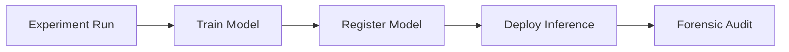

### 3. MLflow Tracking & Metadata Topology
Strategically centralizing disparate experiment parameters, metrics, and artifacts across distributed data science teams into a unified institutional metadata hub.

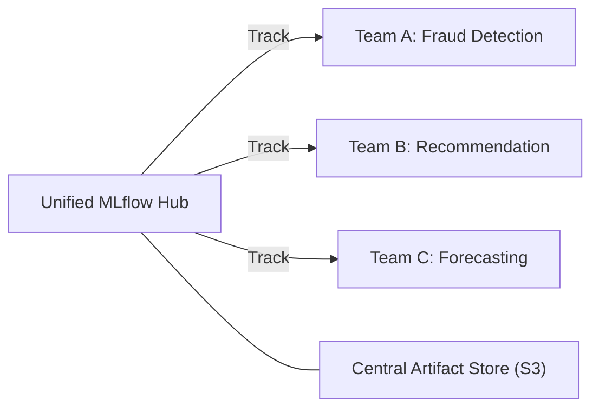

### 4. Model Registry & Versioning Flow
Managing the controlled transition of models through institutional lifecycle stages—from "Staging" and "Production" to "Archived"—ensuring only validated models reach live users.

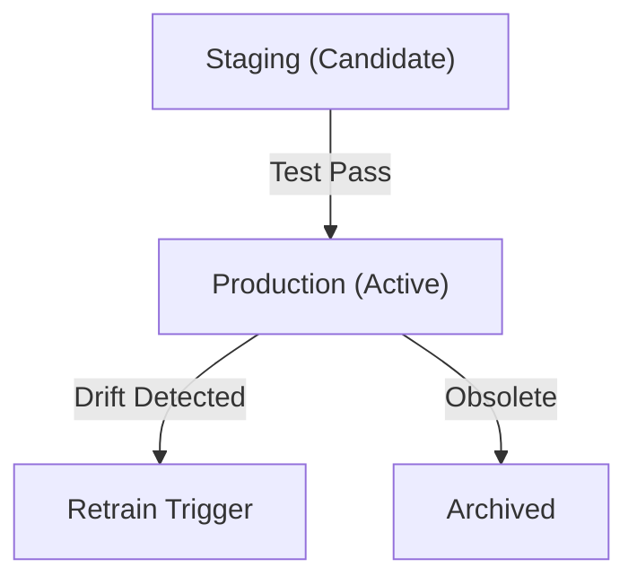

### 5. Artifact Storage & Geo-Replication Flow
Managing high-volume model binary files and serialized artifacts across geographic boundaries, providing low-latency access for distributed inference clusters.

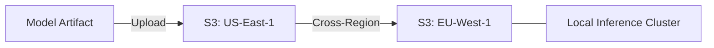

### 6. CI/CD for Machine Learning (MLOps) Flow
Integrating model training and deployment into a unified CI/CD pipeline, ensuring that every code change triggers a reproducible training run and validation cycle.

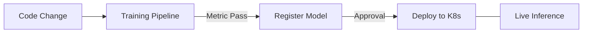

### 7. Institutional ML Maturity Scorecard
Grading organizational performance based on key indicators: Reproducibility Rate, Model Drift Response Time, and Governance Coverage.

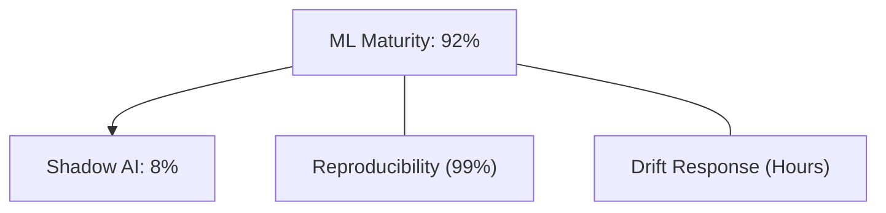

### 8. Identity & RBAC for MLOps Governance
Managing fine-grained access to experiment runs, model versions, and artifact storage between Data Scientists, ML Engineers, and Model Compliance Officers.

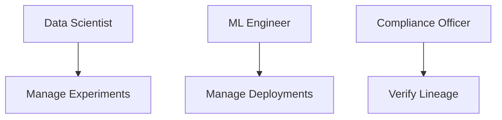

### 9. IaC Deployment: MLOps-as-Code Framework
Using modular Terraform to deploy and manage the versioned distribution of the MLflow tracking hubs, model registries, and forensic metadata lakes.

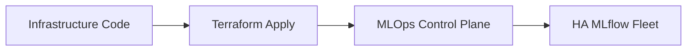

### 10. AIOps Model Drift & Performance Validation Flow
Using advanced analytics to identify decay in model accuracy or shifts in input data distributions, triggering automated alerts and retraining workflows.

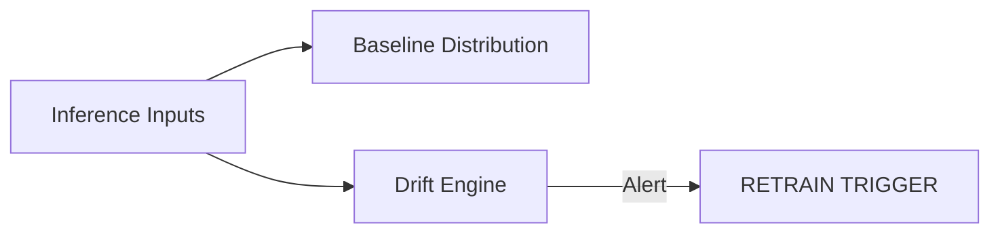

### 11. Metadata Lake for Forensic ML Audit
Storing long-term records of every experiment run, parameter set, and deployment decision for institutional record-keeping, compliance auditing, and post-incident forensics.

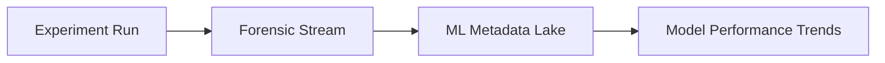

---

## 🏛️ Core MLOps Pillars

1.  **Unified Experiment Tracking**: Maximizing reproducibility by capturing all parameters, metrics, and code versions.
2.  **Controlled Model Governance**: Enforcing institutional workflows for model promotion and production approval.
3.  **Automated Validation Pipelines**: Guaranteeing model quality and safety before inference deployment.
4.  **Real-Time Drift Intelligence**: Identifying and responding to model decay through continuous monitoring.
5.  **Multi-Cloud Artifact Scalability**: Managing global distribution of large model assets with low-latency access.
6.  **Full ML Auditability**: Immutable recording of every experiment run and deployment decision for institutional forensics.

---

## 🛠️ Technical Stack & Implementation

### MLOps Engine & APIs
*   **Framework**: Python 3.11+ / FastAPI.
*   **Tracking Hub**: MLflow Tracking Server with PostgreSQL backend.
*   **Registry Hub**: MLflow Model Registry for versioned lifecycle management.
*   **Persistence**: PostgreSQL (Metadata Lake) and Redis (Live Cache).
*   **Auth Orchestrator**: Federated OIDC/SAML for least-privilege ML asset access.

### ML Intelligence Dashboard (UI)
*   **Framework**: React 18 / Vite.
*   **Theme**: Dark, Purple, Slate (Modern high-fidelity AI/ML aesthetic).
*   **Visualization**: Recharts for training curves, drift trends, and model performance heatmaps.

### Infrastructure & DevOps
*   **Runtime**: AWS EKS or Azure Kubernetes Service (AKS).
*   **Artifact Plane**: Scalable object storage (S3/GCS) with global replication capabilities.
*   **IaC**: Modular Terraform for deploying the MLOps hub and registry distributions.

---

## 🏗️ IaC Mapping (Module Structure)

| Module | Purpose | Real Services |
| :--- | :--- | :--- |
| **`infrastructure/mlops_hub`** | Central management plane | EKS, PostgreSQL, Redis |
| **`infrastructure/registry`** | Model versioning engine | MLflow Server, S3 |
| **`infrastructure/inference`** | Real-time serving fleet | K8s Service, Horizontal Autoscaler |
| **`infrastructure/auditing`** | Forensic ML sinks | S3, Athena, Quicksight |

---

## 🚀 Deployment Guide

### Local Principal Environment
```bash
# Clone the MLOps platform
git clone https://github.com/devopstrio/mlflow-enterprise-template.git
cd mlflow-enterprise-template

# Configure environment
cp .env.example .env

# Launch the MLOps stack
make init

# Trigger a mock experiment run and model registration simulation
make simulate-mlflow
```

Access the ML Intelligence Hub at `http://localhost:3000`.

---

## 📜 License
Distributed under the MIT License. See `LICENSE` for more information.

---
<div align="center">
  <p>© 2026 Devopstrio. All rights reserved.</p>
</div>
