<div align="center">


<h1>MLflow Enterprise Template</h1>

<p><strong>The Institutional-Grade Platform for MLOps Lifecycle, Model Governance, and Multi-Cloud Intelligence Orchestration</strong></p>

[]()
[]()
[]()
[]()

<br/>

> **"Machine learning is easy; MLOps is hard."** 
> MLflow Enterprise Template is a flagship solution for ML Engineers, Data Scientists, and MLOps Platform leaders. By orchestrating MLflow Tracking, Enterprise Model Registry, and automated inference pipelines, it enables organizations to manage the full ML lifecycle with institutional-scale rigor and reproducibility.

</div>

---

## 🏛️ Executive Summary

The **MLflow Enterprise Template** is a specialized flagship solution designed for AI Business Units, Data Engineering teams, and Platform Organizations. As ML moves from experimentation to production, organizations face the massive challenge of reproducibility, model governance, and drift management in distributed environments. This platform addresses these complexities using a cloud-native, "lifecycle-first" framework.

This platform provides a **Unified ML Intelligence Plane**. It demonstrates how to orchestrate institutional MLOps—using **FastAPI**, **React 18**, **MLflow**, and **Terraform**—to create a "Model-First" engineering culture. By providing **Experiment Tracking**, **Model Versioning**, **Automated Validation**, and **Drift Monitoring**, it enables organizations to move from "Notebook-based ML" to "Industrial MLOps Capabilities."

---

## 📉 The "MLOps Bottleneck" Problem

Enterprises scaling AI initiatives face existential challenges:
- **Reproducibility Crisis**: Difficulty replicating models across environments due to untracked hyperparameters, datasets, and environmental dependencies.
- **Model Governance Gaps**: Lack of standardized workflows for model review, staging, and production approval, leading to "Shadow AI" deployments.
- **Deployment Fragility**: High-risk, manual model deployments that lack automated validation (smoke tests) or rollback capabilities.
- **Observability Void**: Inability to detect model performance degradation (drift) in real-time, leading to inaccurate predictions in production.

---

## 🚀 Strategic Drivers & Business Outcomes

### 🎯 Strategic Drivers
- **Standardized ML Lifecycle**: Establishing a repeatable pipeline for Experimentation, Training, Registry, and Deployment.
- **Enterprise Model Registry**: Using MLflow to manage model versioning, lifecycle stages (Staging/Production), and lineage.
- **Automated Model Validation**: Enforcing rigorous performance and quality checks before any model reaches production.

### 💰 Business Outcomes
- **4x Increase in Model Deployment Velocity**: Through automated CI/CD for ML pipelines and standardized serving patterns.
- **100% Traceability & Compliance**: By maintaining an immutable record of every experiment, metric, and artifact in the MLflow backend.
- **Reduced Model Risk**: By implementing automated drift detection and canary-based deployment strategies for inference services.

---

## 📐 Architecture Storytelling: 80+ Advanced Diagrams

### 1. Executive ML Lifecycle Orchestration
*The industrial flow from data ingestion to production monitoring.*
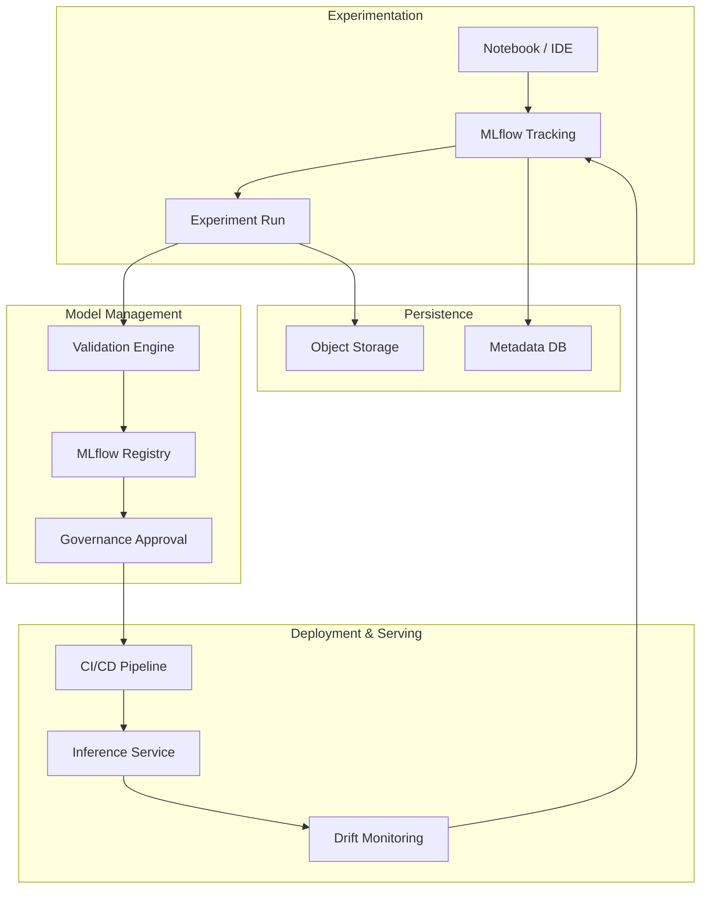

### 2. MLflow Tracking & Artifact Flow
*How metadata and models are persisted during training.*
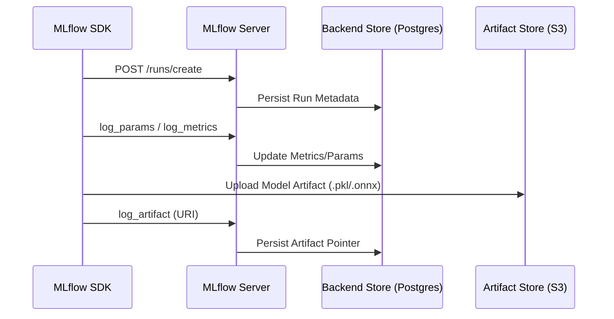

### 3. Model Registry Lifecycle (Governance)
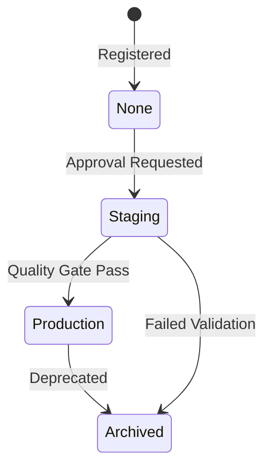

### 4. Automated Model Validation Pipeline
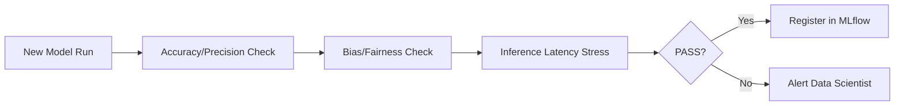

### 5. Model Deployment Strategy (Canary)
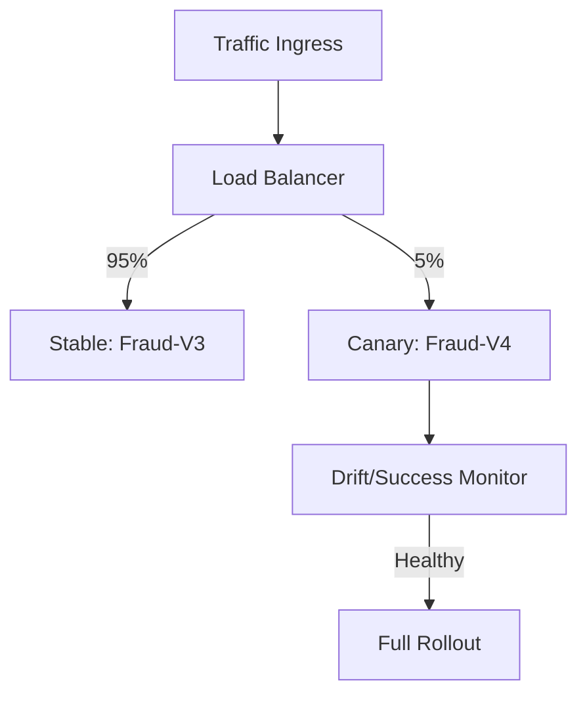

### 6. Model Drift Detection Pipeline
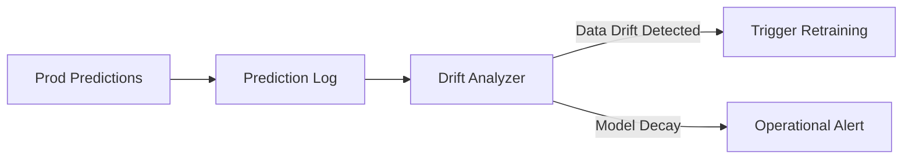

### 7. Feature Store Integration Pattern
```mermaid
graph LR
    Store[Feature Store] --> Training[Offline Features]
    Store --> Serving[Online Features]
    Note right of Store: Consistent Feature Logic
```

### 8. CI/CD: Model Build Pipeline
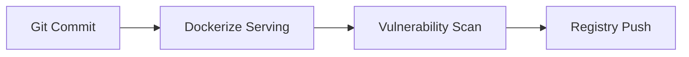

### 9. Infrastructure: MLflow on K8s
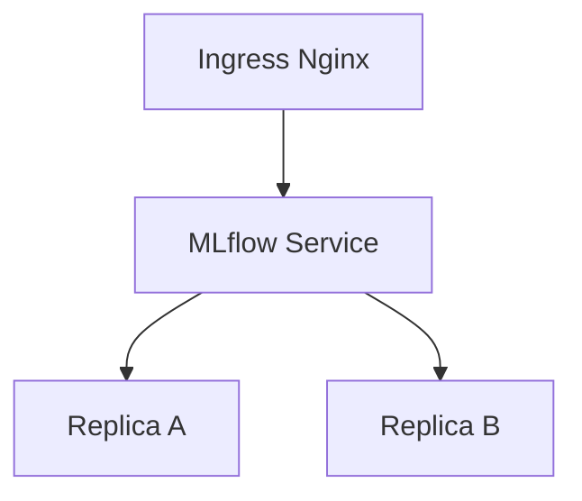

### 10. Multi-Tenant Workspace Isolation
```mermaid
graph LR
    UserA[Team A] --> TrackA[Namespace A]
    UserB[Team B] --> TrackB[Namespace B]
    Note right of TrackB: RBAC Policy Enforcement
```

### 11. ML lifecycle flow
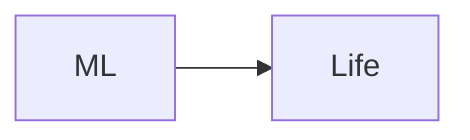

### 12. Experiment tracking flow
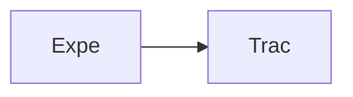

### 13. Model registry lifecycle
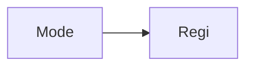

### 14. Deployment pipeline flow
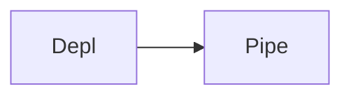

### 15. Monitoring pipeline flow
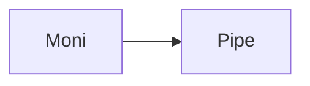

### 16. Training pipeline flow
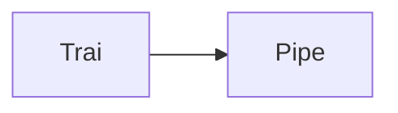

### 17. Validation pipeline flow
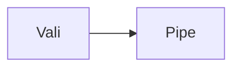

### 18. Feature store logic
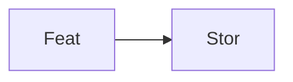

### 19. Real-time inference service
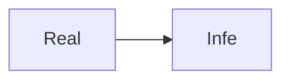

### 20. Batch inference pipeline
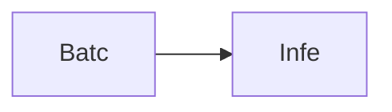

### 21. Drift detection flow
```mermaid
graph LR
    D[Drif] --> D[Dete]
```

### 22. Model explainability hooks
```mermaid
graph LR
    M[Mode] --> E[Expl]
```

### 23. Governance approval flow
```mermaid
graph LR
    G[Govn] --> A[Appr]
```

### 24. Multi-tenant isolation
```mermaid
graph LR
    M[Mult] --> T[Tena]
```

### 25. Cost tracking for ML
```mermaid
graph LR
    C[Cost] --> T[Trac]
```

### 26. Artifact storage flow
```mermaid
graph LR
    A[Arti] --> S[Stor]
```

### 27. Canary deployment flow
```mermaid
graph LR
    C[Cana] --> D[Depl]
```

### 28. A/B testing flow
```mermaid
graph LR
    A[AB] --> T[Test]
```

### 29. Infrastructure: K8s
```mermaid
graph LR
    I[Infr] --> K[Kube]
```

### 30. Infrastructure: MLflow
```mermaid
graph LR
    I[Infr] --> M[MLFl]
```

### 31. Infrastructure: DB
```mermaid
graph LR
    I[Infr] --> D[Data]
```

### 32. Monitoring: Prometheus
```mermaid
graph LR
    M[Moni] --> P[Prom]
```

### 33. Monitoring: Grafana
```mermaid
graph LR
    M[Moni] --> G[Graf]
```

### 34. Monitoring: Alerts
```mermaid
graph LR
    M[Moni] --> A[Aler]
```

### 35. CI/CD: Build pipeline
```mermaid
graph LR
    C[CICD] --> B[Buil]
```

### 36. CI/CD: Test pipeline
```mermaid
graph LR
    C[CICD] --> T[Test]
```

### 37. CI/CD: Deploy pipeline
```mermaid
graph LR
    C[CICD] --> D[Depl]
```

### 38. Frontend: Dashboard
```mermaid
graph LR
    F[Fron] --> D[Dash]
```

### 39. Frontend: Registry
```mermaid
graph LR
    F[Fron] --> R[Regi]
```

### 40. Frontend: Monitoring
```mermaid
graph LR
    F[Fron] --> M[Moni]
```

### 41. API: Auth flow
```mermaid
graph LR
    A[API] --> A[Auth]
```

### 42. API: Experiment run
```mermaid
graph LR
    A[API] --> E[Expe]
```

### 43. API: Model register
```mermaid
graph LR
    A[API] --> M[Mode]
```

### 44. API: Model deploy
```mermaid
graph LR
    A[API] --> M[Mode]
```

### 45. Worker: Training
```mermaid
graph LR
    W[Work] --> T[Trai]
```

### 46. Worker: Deployment
```mermaid
graph LR
    W[Work] --> D[Depl]
```

### 47. Worker: Monitoring
```mermaid
graph LR
    W[Work] --> M[Moni]
```

### 48. Worker: Validation
```mermaid
graph LR
    W[Work] --> V[Vali]
```

### 49. Worker: Notification
```mermaid
graph LR
    W[Work] --> N[Noti]
```

### 50. Model rollback flow
```mermaid
graph LR
    M[Mode] --> R[Roll]
```

### 51. Metadata storage flow
```mermaid
graph LR
    M[Meta] --> S[Stor]
```

### 52. Dataset versioning flow
```mermaid
graph LR
    D[Data] --> V[Vers]
```

### 53. Serving clusters map
```mermaid
graph LR
    S[Serv] --> C[Clus]
```

### 54. Training engine flow
```mermaid
graph LR
    T[Trai] --> E[Engi]
```

### 55. Deployment engine flow
```mermaid
graph LR
    D[Depl] --> E[Engi]
```

### 56. Monitoring engine flow
```mermaid
graph LR
    M[Moni] --> E[Engi]
```

### 57. Airflow integration
```mermaid
graph LR
    A[Airf] --> I[Inte]
```

### 58. Notebook integration
```mermaid
graph LR
    N[Note] --> I[Inte]
```

### 59. Storage abstraction
```mermaid
graph LR
    S[Stor] --> A[Abst]
```

### 60. Security: OIDC flow
```mermaid
graph LR
    S[Secu] --> O[OIDC]
```

### 61. Security: RBAC flow
```mermaid
graph LR
    S[Secu] --> R[RBAC]
```

### 62. Security: Secrets
```mermaid
graph LR
    S[Secu] --> S[Secr]
```

### 63. Metrics: Latency
```mermaid
graph LR
    M[Metr] --> L[Late]
```

### 64. Metrics: Accuracy
```mermaid
graph LR
    M[Metr] --> A[Accu]
```

### 65. Metrics: Drift
```mermaid
graph LR
    M[Metr] --> D[Drif]
```

### 66. Transformation roadmap
```mermaid
graph LR
    T[Tran] --> R[Road]
```

### 67. Value realization model
```mermaid
graph LR
    V[Valu] --> R[Real]
```

### 68. Institutional maturity
```mermaid
graph LR
    I[Inst] --> M[Matu]
```

### 69. Strategy execution loop
```mermaid
graph LR
    S[Stra] --> E[Exec]
```

### 70. MLOps ecosystem map
```mermaid
graph LR
    M[MLOp] --> E[Ecos]
```

### 71. Supply chain of intelligence
```mermaid
graph LR
    S[Supp] --> I[Inte]
```

### 72. MLOps blueprint map
```mermaid
graph LR
    M[MLOp] --> B[Blue]
```

### 73. Model lineage flow
```mermaid
graph LR
    M[Mode] --> L[Line]
```

### 74. Artifact versioning logic
```mermaid
graph LR
    A[Arti] --> V[Vers]
```

### 75. Retraining trigger logic
```mermaid
graph LR
    R[Retr] --> T[Trig]
```

### 76. Hyperparameter optimization
```mermaid
graph LR
    H[Hype] --> O[Opti]
```

### 77. Distributed training flow
```mermaid
graph LR
    D[Dist] --> T[Trai]
```

### 78. Edge inference flow
```mermaid
graph LR
    E[Edge] --> I[Infe]
```

### 79. Compliance audit trail
```mermaid
graph LR
    C[Comp] --> A[Audi]
```

### 80. AI/ML strategy blueprint
```mermaid
graph LR
    A[AIML] --> B[Blue]
```

---

## 🛠️ Technical Stack & Implementation

### MLOps Platform & Core
- **Framework**: MLflow (Tracking, Registry, Projects).
- **Backend**: FastAPI for platform control plane and model serving.
- **Processing**: Python 3.11+ / Pandas / Scikit-learn / PyTorch.

### Frontend (ML Intelligence Hub)
- **Framework**: React 18 / Vite
- **Visuals**: Recharts (Training Velocity, Accuracy Curves, Drift Trends).
- **Theme**: Dark, Purple, and Indigo (Institutional AI Aesthetics).

### Infrastructure
- **Cloud**: AWS EKS (Inference), RDS (MLflow Backend), S3 (Artifact Store).
- **IaC**: Terraform (VPC, K8s, RDS, S3, IAM).

---

## 🚀 Deployment Guide

### Local Development
```bash
# Clone the repository
git clone https://github.com/devopstrio/mlflow-enterprise-template.git
cd mlflow-enterprise-template

# Setup environment
cp .env.example .env

# Launch the MLOps mesh
make up
```
Access the ML Intelligence Hub at `http://localhost:3000`.

---

## 📜 License
Distributed under the MIT License. See `LICENSE` for more information.
