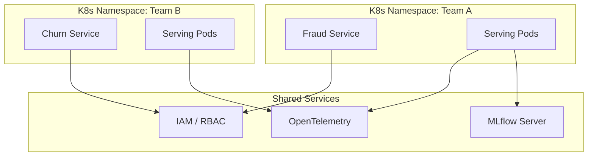
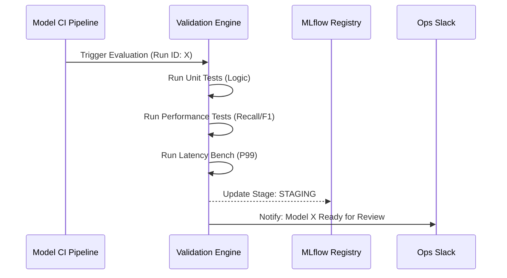
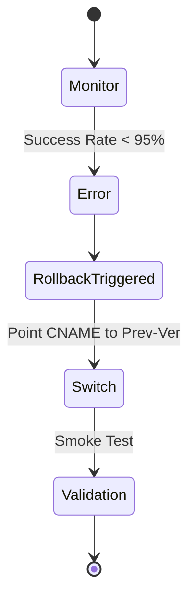

# Architecture & Deployment Diagrams

## 31. Multi-tenant Inference Cluster Architecture

```mermaid
graph TD
    subgraph "K8s Namespace: Team A"
        SvcA[Fraud Service]
        PodA[Serving Pods]
    end
    subgraph "K8s Namespace: Team B"
        SvcB[Churn Service]
        PodB[Serving Pods]
    end
    subgraph "Shared Services"
        IAM[IAM / RBAC]
        OTEL[OpenTelemetry]
        MLF[MLflow Server]
    end

    SvcA --> IAM
    SvcB --> IAM
    PodA --> OTEL
    PodB --> OTEL
    PodA --> MLF
```

## 40. Automated Model Validation Flow

```mermaid
sequenceDiagram
    participant CI as Model CI Pipeline
    participant Val as Validation Engine
    participant MLF as MLflow Registry
    participant Ops as Ops Slack

    CI->>Val: Trigger Evaluation (Run ID: X)
    Val->>Val: Run Unit Tests (Logic)
    Val->>Val: Run Performance Tests (Recall/F1)
    Val->>Val: Run Latency Bench (P99)
    Val-->>MLF: Update Stage: STAGING
    Val->>Ops: Notify: Model X Ready for Review
```

## 50. Model Rollback State Machine

```mermaid
stateDiagram-v2
    [*] --> Monitor
    Monitor --> Error: Success Rate < 95%
    Error --> RollbackTriggered
    RollbackTriggered --> Switch: Point CNAME to Prev-Ver
    Switch --> Validation: Smoke Test
    Validation --> [*]
```
