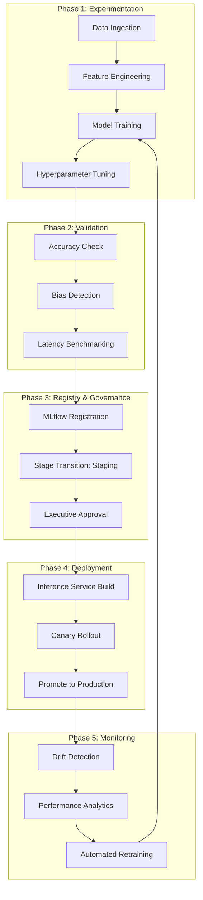
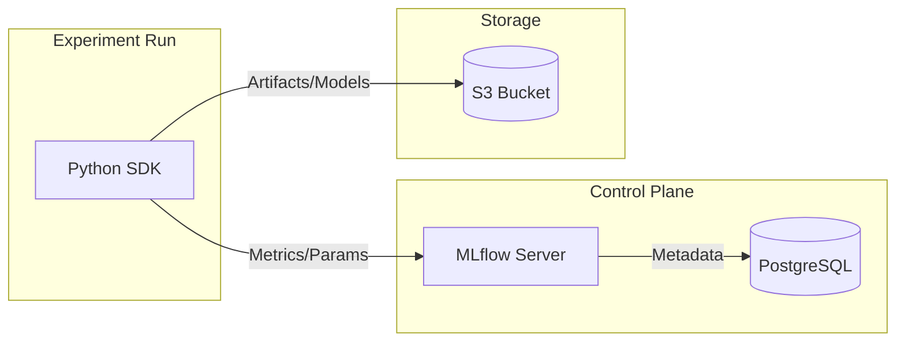
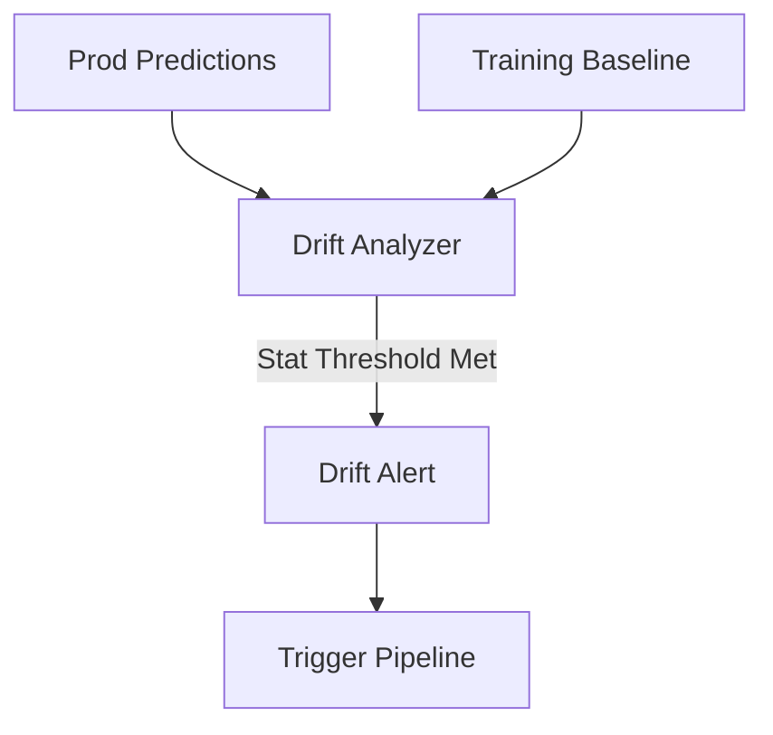

# MLOps & Lifecycle Diagrams

## 11. Industrial ML Lifecycle (Detailed)
*The end-to-end orchestration of an ML model from discovery to production.*

## 15. MLflow Tracking Persistence Architecture

## 20. Model Drift Detection Logic

